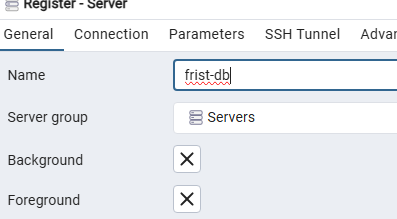
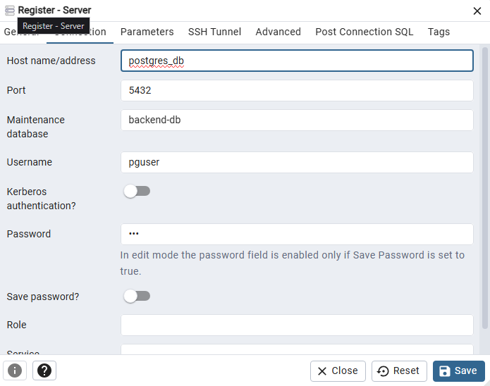

# backend-test
Welcome to NodeJs note
This repo is for understanding API, backend with mostly used node js, and it's for getting comfortable with deplying projects in kuberentes or dokcer, and sepcefically troubleshooting issues after something like helm installations and things crash suddenly.

# npm
start your nodejs project with 
```bash
npm init -y
## -y is for accepting some default values about the fiirst project data
```
It creates package.json (check it out)

# Build Server
Let's start building the server with Express framwork
```bash
npm install express
```
It creates `package-lock.json`, modules version will be stored in here, and `node-modules` dir with the modules.

# Create your app
write your app as `app.js` 
then run the app as follows to start your server:
```bash
node app.js
```

Issue could be in restarting the server each time you update your code, it could be resolved with `nodemon` as follows:
```bash
npx nodemon app.js
```

# Endpoint
In `app.js` you can see different types of responses user can get
It could be some calculations, also it could be json, html, etc.. .

# Request
GET, POST, PUT, DELETE, PUSH

# Connect to Postgres db
We created a postgres db in postgres folder using `docker-compose` only for testing and interacting with db.

I started by adding the database data as a veriable in dokcer-compose:
```yaml
      POSTGRES_USER: <username>
      POSTGRES_PASSWORD: "<password>"
      POSTGRES_DB: <database-name>
```
But I'd prefere putthing it into a separate env file.
```yaml
  db:
    env_file: .env
```

* I separated the tests of showing maintenance html page and sum of number under `Test nodejs` to practice it with different type of requests.

After that we need to add a connetion to db part in `models/index.js` to connect to db, and `models/article.js` to create and get a table with specific columns.

Then we call it from `app.js` with routes post and get for `/article` on port `3000` to insert the data into db.

```bash
#post the data
curl -X POST http://localhost:3000/articles \
  -H "Content-Type: application/json" \
  -d '{"title":"My first article","body":"Hello Postgres!","published":true}'

#Output
{"id":1,"title":"My first article","body":"Hello Postgres!","published":true,"created_at":"2025-08-30"}
```

```bash
#get the data
curl http://localhost:3000/articles

#Output
[{"id":1,"title":"My first article","body":"Hello Postgres!","published":true,"created_at":"2025-08-30T02:02:10.838Z"}]
```

Now you can verify the resule from insde the db with 2 ways:
1- using cli as follows:
```bash
docker exec -it postgres_db psql -U pguser -d backend-db

backend-db=# \dt
         List of relations
 Schema |   Name   | Type  | Owner
--------+----------+-------+--------
 public | articles | table | pguser
(1 row)

backend-db=# SELECT * FROM articles;
 id |      title       |      body       | published |         created_at
----+------------------+-----------------+-----------+----------------------------
  1 | My first article | Hello Postgres! | t         | 2025-08-30 05:02:10.838487
(1 row)
```

2- In my case i decided to use pgAdmin as well to see the updates over GUI check the `docker-compose.yaml`.

here the steps to connect to my db and see the results of my post request.

Register you db
please note that the hostname is the name of postgres docker container, check the `docker-compose.yaml`







I